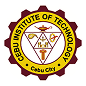

<div align="center">



# CSIT-226: WOCM
**Web-based Organization & Chapter Management System**

> A comprehensive web platform designed to streamline student organization management, event tracking, and attendance monitoring for the Cebu Institute of Technology – University (CIT-U). 

</div>

---

##  Project Overview
Managing student organizations, coordinating events, and tracking attendance can be chaotic when done manually or through fragmented tools. 

**WOCM** was developed as a CSIT-226 project to centralize these processes. It provides a structured, role-based web application where Administrators, Organization Officers, and Students can interact seamlessly. By digitizing event management and utilizing an attendance scanner, the system eliminates paperwork and ensures accurate, real-time tracking of student involvement.

---

##  Key Features & User Roles

The system is divided into three main role-based portals to ensure secure and relevant access for all users:

###  Administrator
* **Manage Organizations:** Create and oversee various university clubs and chapters.
* **Manage Users & Students:** Control system access, oversee student accounts, and maintain directory integrity.

###  Organization Officer
* **Event Management:** Create, update, and manage organization-specific events.
* **Member Management:** Oversee the student roster within their specific organization.
* **Attendance Scanner:** Dedicated interface to quickly and accurately record student attendance during events.

###  Student
* **Discover Organizations:** Browse and view available university organizations.
* **Event Tracking:** Keep track of upcoming events they can attend.
* **Attendance History:** View their personal attendance records for transparency and compliance.

---

## 🛠️ Technologies Used

This project is built as a dynamic web application using a standard LAMP/WAMP stack:

* **Frontend:** HTML5, CSS3, JavaScript
* **Backend:** PHP (Native)
* **Database:** MySQL (managed via standard SQL schemas)
* **Design/UI:** Custom styling (`style.css`) with CIT-U branding elements.

### System Architecture
* **Role-Based Access Control (RBAC):** Secure routing and authentication preventing unauthorized access between Student, Officer, and Admin dashboards.
* **Relational Database Management:** Structured database tables (`schema.sql`) maintaining relationships between students, their enrolled organizations, events, and attendance logs.

---

##  Project Structure Snapshot
```text
WOCM/
├── admin/          # Admin portal (manage orgs, students, users)
├── officer/        # Officer portal (attendance scanner, events, members)
├── student/        # Student portal (view attendance, events, orgs)
├── database/       # Contains schema.sql for database initialization
├── includes/       # Reusable components (headers, footers, db_connect)
├── assets/         # CSS styles, JS scripts, and images (CIT-U branding)
└── index.php       # Landing page / Login router
